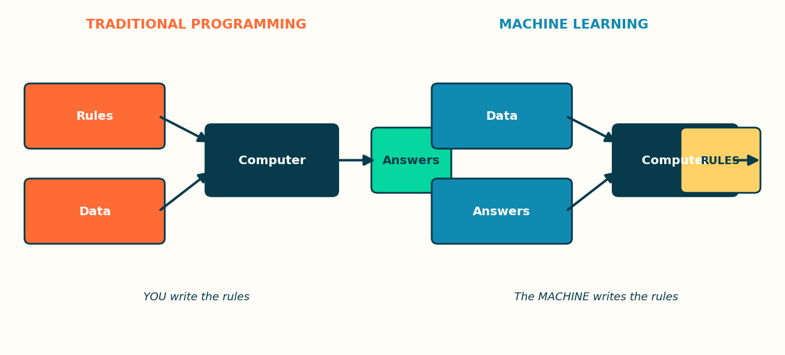
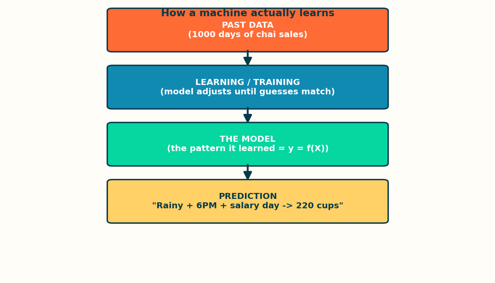
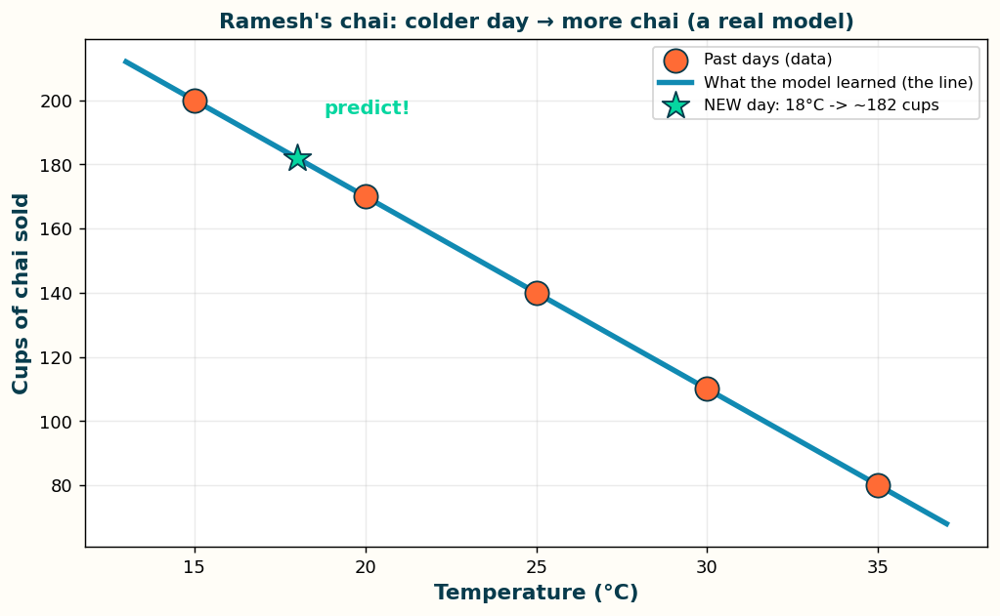

# 🎬 Video 1 — What is Machine Learning, *really?*

> **Day 1 of 30** · ~7 min · [◀ Back to the map](README.md) · [Watch on YouTube](https://www.youtube.com/@aiwithrav)
>
> 🎯 **In One Line:** Machine Learning is teaching a computer to learn patterns from examples — instead of you writing the rules by hand.

---

## 🫖 Start here: the chai stall

Picture **Ramesh**, who runs a chai stall outside a Mumbai station.

Nobody gave Ramesh a rulebook. But after 3 years, he *just knows*:
- Rainy evening + local train delayed → **sell more chai, keep extra ginger**
- Hot afternoon → **nimbu paani sells, chai doesn't**
- Salary day (1st of month) → **everyone buys, stock up**

Ramesh was never *programmed*. He **learned from thousands of days of examples.** He saw the pattern: *weather + time + crowd → how much chai to make.*

> 🟡 **That is Machine Learning.** A machine, like Ramesh, looking at thousands of past examples and figuring out the pattern **by itself** — so it can predict the future.

You didn't write "if raining, then more chai." **The data taught it.** That's the whole idea.

---

## 🆚 The big shift: old way vs ML way

This one picture is the entire reason ML exists 👇



*In normal coding YOU write the rules and the computer gives answers. In ML you give the computer answers (examples) and it writes the rules itself.*

> 🟢 **The intuition:** In normal coding, *you* are the smart one — you write every rule. In ML, you let the **machine become smart** by showing it examples and letting it discover the rules.

**Why this is revolutionary:** some problems have **too many rules to ever write by hand.**
How would you write `if-else` rules to recognise a cat in a photo? A cat can be black, orange, sitting, jumping, half-hidden… you'd need a *million* rules. Impossible.

But show a machine 10,000 cat photos? It learns "cat-ness" on its own. 🐱

---

## 🖼 The Picture — how learning actually happens



> 🟡 **Remember this word: `model`.** People say it constantly. A "model" is just **the pattern the machine learned, saved as a math formula.** That's it. Not scary.

---

## 🌍 You already use ML 20 times a day (Indian edition)

| When you… | ML is quietly working |
|---|---|
| Open **YouTube** and it suggests the *perfect* next video | Learned from your watch history |
| **Google Pay / PhonePe** flags a suspicious transaction | Learned what fraud "looks like" |
| **Instagram/reels** knows you *way* too well | Learned your scroll patterns |
| **Ola/Uber** shows surge pricing before the rain | Learned demand patterns |
| **Gmail** auto-sorts spam / "Promotions" | Learned from billions of emails |
| **Netflix/Hotstar** "Because you watched…" | Learned viewer similarities |

> 🟢 You don't need a PhD to understand ML. **You're already living inside it.** This series just shows you the machinery behind the magic.

---

## 🧮 The Math — *(technical viewers: this box is for you. Non-technical? Skip it, you lose nothing.)*

At its heart, every ML model is trying to learn a **function** `f` that maps input `X` to output `y`:

```
        y  =  f(X)

   X  = the inputs      (weather, time, crowd)   → called "features"
   y  = the answer      (cups of chai sold)        → called "label" / "target"
   f  = the pattern     (what the machine learns)  → the "model"
```

- **Traditional code:** *you* define `f` by hand.
- **Machine Learning:** you give the machine many `(X, y)` pairs, and it **searches for the `f`** that best turns every `X` into the right `y`.

"Learning" = adjusting `f` little by little to shrink the gap between its guess `ŷ` and the truth `y`. That gap has a name — the **loss**. All of training is just: *"make the loss smaller."*

> 🔵 You'll see this exact idea again in **Video 5 (Linear Regression)** where `f` is literally a straight line, and in every neural network and every LLM after that. **Same idea, bigger formula.** This is the seed of everything.

---

## 🔴 Common mistake (clear this up now)

> **"ML = robots / AI will take over."**
> No. 99% of real ML is **boring and useful**: predicting sales, flagging fraud, recommending videos, reading handwriting. It's a **pattern-finding tool**, like a very advanced Excel that writes its own formulas. Respect it, don't fear it.

Also:
> **"AI, ML, Deep Learning — same thing?"**
> Not quite. **AI** is the big umbrella (any smart behaviour). **ML** is one way to do AI (learn from data). **Deep Learning** is one powerful *type* of ML (using neural nets). We'll nail this in Video 2 & 20. For now: **ML = learning from examples.**

---

## ⚙️ Try It — your first "model" in 6 lines *(optional, for the curious)*

No installs needed to *understand* it — just read it like English:

```python
from sklearn.linear_model import LinearRegression

# Past data: [temperature] → cups of chai sold
X = [[15], [20], [25], [30], [35]]     # temperature (feature)
y = [200, 170, 140, 110, 80]           # cups sold  (label)

model = LinearRegression()             # an empty brain
model.fit(X, y)                        # 👈 THIS is "learning"

print(model.predict([[18]]))           # a new day: 18°C → how many cups?
# ➜ it predicts ~182 cups, having learned "colder = more chai"
```

**And here's what the machine actually learned — a line:**



*The orange dots are past days (the data). The blue line is what the model learned. The green star is a brand-new day it predicts — that's the magic of `.fit()`.*

> 🟡 That one line — `model.fit(X, y)` — is **the entire heart of Machine Learning.** Everything in the next 29 days is a more powerful version of `.fit()`.

---

## 🎁 Recap — the 20-second version

1. **ML = learning patterns from examples**, instead of writing rules by hand.
2. Old way: *you* write rules. ML way: the **machine finds the rules** from data.
3. The learned pattern is called a **model** (`y = f(X)`).
4. You already use it 20× a day — YouTube, GPay, Instagram.
5. Training = **making the wrong guesses less wrong** (shrinking the loss).

---

## ➡️ Next up — Video 2

**The 3 Families of ML: Supervised, Unsupervised, Reinforcement.**
Just like a child learns 3 ways — *with a teacher, by exploring, and by reward/punishment* — a machine does too. See you Day 2. 🙏

> 💬 *If this made sense, that's the point. Share the channel with one friend who thinks ML is "too hard." — Rav*
